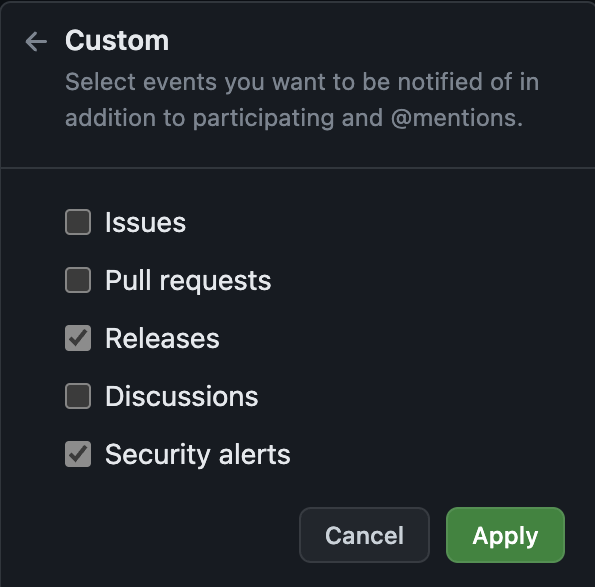

La maintenance des applications informatiques consiste à assurer la disponibilité du logiciel.
Nous pouvons intervenir avant qu'un dysfonctionnement intervienne : il s'agit de maintenance préventive.

Nous pouvons également intervenir après qu'un dysfonctionnement intervienne: il s'agit de maintenance corrective.

## En quoi consiste la maintenance ?

La maintenance consiste à modifier une partie du code du logiciel pour en corriger les dysfonctionnements ou en améliorer son efficacité.
Cette partie du code peut être dans une dépendance (ou bibliothèque) externe.
Cela peut également venir du langage d'exécution en lui-même.

Chaque type de maintenance à son lot d'avantages et d'inconvénients.

Quel que soit le type de maintenance, les actions effectuées sont les mêmes.
Cela peut concerner le remplacement d'une version d'une ou plusieurs dépendances par :
- une mise à jour de la dépendance qui corrige des problèmes que d'autres ont rencontrés
- un remplacement de la dépendance par une autre dépendance plus efficace et/ou toujours maintenue.
- une suppression d'une dépendance inutile

Cela peut concerner du code spécifique à l'application qui est lié à une mauvaise pratique ou un mauvais usage.
Par exemple, l'absence de contrôle des données d'entrée d'un webservice peut entrainer une alteration non désirée des données dans la base de données.

_Le cas le plus courant d'un manque de contrôle est l'élévation de privilège._

## Prévenir avec la maintenance préventive

Comme son nom l'indique, la maintenance préventive intervient **_avant_** qu'un problème ne surgisse.

Il s'agit d'anticiper d'éventuels dysfonctionnements en remplaçant certains composants du logiciel.

### Se tenir informé ...

Pour anticiper d'éventuels problèmes il est important de se tenir informé.
Pour cela, il est important de faire de la veille. 
Cette veille peut être manuelle par de lecture de sites spécialisés .
On peut également s'abonner à différentes sources d'informations afin d'être notifié (par mail, flux RSS, ...) lorsqu'un problème est rencontré.

### ... et prendre la bonne décision

Lorsque nous sommes informés d'un dysfonctionnement d'un composant du logiciel, il ne faut pas forcement se précipiter.
En effet, le risque de mettre à jour rapidement un composant pour corriger un futur problème est d'entrainer d'autres problèmes non prévu.

Il est donc important d'évaluer les risques avant de faire le changement.

De plus, selon le type de mise à jour, les impacts sur le code existant peut être plus ou moins important.
Il faut donc estimer les impacts de la mise à jour et le temps à passer pour faire cette mise à jour.

### Quel est l'intérêt d'une maintenance préventive ?

Il est important de consacrer du temps pour la maintenance préventive. 
Du temps pour faire la veille et évaluer les risques et du temps pour faire les modifications nécessaires.

Le temps passé à prévenir les problèmes permet d'économiser le temps lorsque les problèmes arriveront.
Car lorsque les problèmes arrivent, les conséquences peuvent être importantes.

Pour faire une analogie : la maintenance préventive, c'est un peu comme le monde automobile. 
En effet, si l'entretien de votre voiture est fait régulièrement vous éviterez le plus possible les gros problèmes et les conséquences qui en découlent.

## Guérir avec la maintenance corrective

La maintenance corrective intervient **_après_** qu'un problème soit détecté.

## Le juste milieu : la maintenance prédictive 
